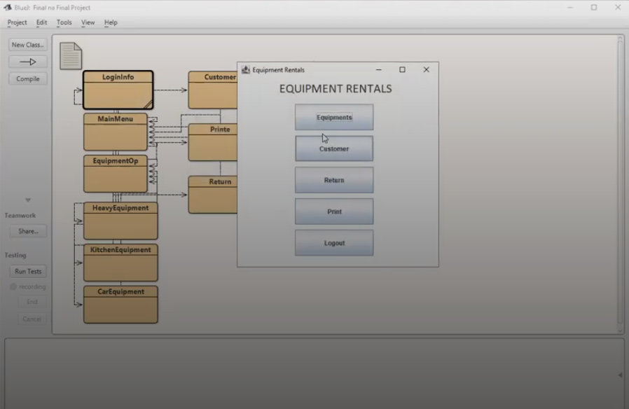
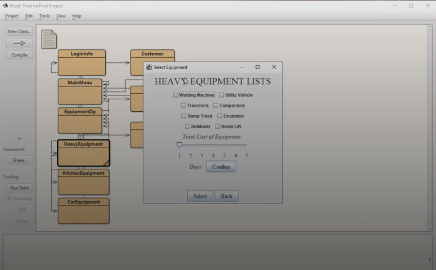

# Equipment Rental System

**A Java GUI Application for Managing Equipment Rentals**

## Project Overview

**Object-Oriented Project**

The Equipment Rental System is a Java-based application built using `javax.swing` for a graphical interface, developed in BlueJ. This program helps users rent, return, and manage equipment with an intuitive, user-friendly interface. It is ideal for small businesses or organizations that need a simple solution to handle equipment rentals efficiently.

## Features

- **Equipment List**: View a list of available equipment for rent.
- **Rent Management**: Rent out equipment, specifying rental period and renter information.
- **Return Equipment**: Process returns and check the rental history of each item.

## Screenshots

### Main Menu

### Equipment List

## Tech Stack

- **Language**: Java
- **IDE**: BlueJ
- **GUI Library**: `javax.swing` for building the user interface
- **File Handling**: Uses text files (or other simple storage) for persisting data

## Members

- **Nicolai Isaiah Santos**
- **John Meynard Demandate**

  
